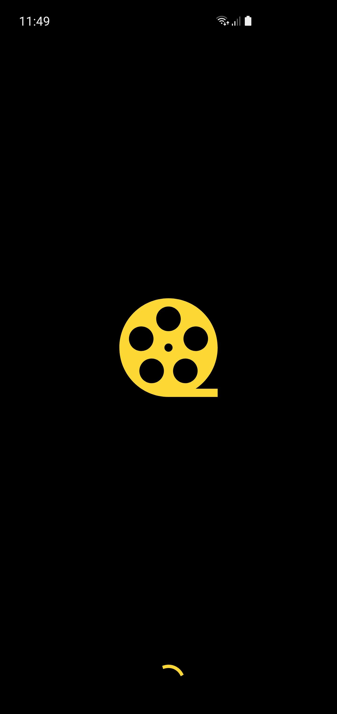
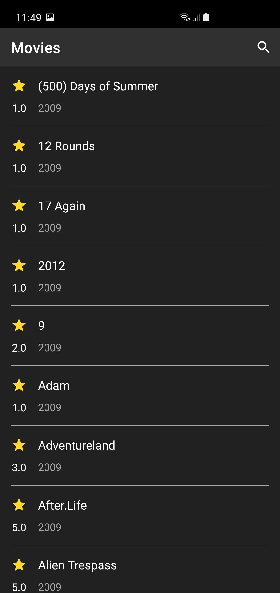
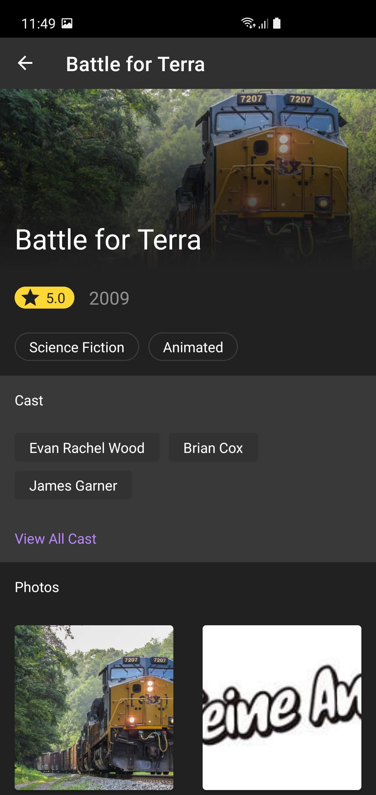

# Movies App

  
  
  
   

This Application is developed for to demonstrate MVVM architecture and other best practices to develop an andorid app.

## Build Instructions ##

The [gradle build system](http://tools.android.com/tech-docs/new-build-system/user-guide) will fetch all dependencies and generate
files you need to build the project. After this select device and run it.

You can use [Android Studio](http://developer.android.com/sdk/installing/studio.html) by importing the project as a Gradle project.

## Directory structure ##

    `|-- base                            # base module (contains providers and streamer)
     |    |-- build.gradle               # base build script
     |    `-- src
     |          |-- main
     |                |-- assets         # base module assets
     |                |-- java           # base module kotlin code
     |                `-- res            # base module resources

## Features :

- Using MVVM (Model-View-ViewModel) Architecture
- Using Hilt for Dependency Injection
- Using Navigation Component to navigate beteween fragments
- Using JUnit4 with Mockito to write Unit tests
- Using Glide for loading image from url
- Using Retrofit to request api network
- Using Kotlin Coroutines for async request
- Using Constraint Layout with chaining for responsive UI
- Using Flexbox layout to show cast and geres
- Using Material Design and materail guidelines for attractive UI
- Using Material shared animations to navigate between fragments

## Dependencies :

- [Lifecycle & Livedata](https://developer.android.com/jetpack/androidx/releases/lifecycle)
- [Navigation Component](https://developer.android.com/jetpack/androidx/releases/navigation)
- [Retrofit 2](https://square.github.io/retrofit/)
- [Glide](https://github.com/bumptech/glide)
- [Hilt](https://developer.android.com/training/dependency-injection/hilt-android)
- [AndroidX](https://mvnrepository.com/artifact/androidx)
- [Mockito](https://developer.android.com/training/testing/unit-testing/local-unit-tests)
- [Kotlin Coroutines](https://developer.android.com/kotlin/coroutines)
- [Flexbox Layout](https://android-developers.googleblog.com/2017/02/build-flexible-layouts-with.html)
- [Material design](https://material.io/develop/android)
- [Constraint Layouts](https://developer.android.com/reference/androidx/constraintlayout/widget/ConstraintLayout)

## Author

[**Muhammad Hammad Khan**](www.linkedin.com/in/i-hammad-khan)